<h1>Abalone</h1>
Abalone is a two-player abstract strategy board game. This is a fork from <a href="https://github.com/szymeklimek/Abalone">Abalone</a>. 
It is redesigned with many extra options, functionalities and menu options.
It is an AI game that uses <a href="https://www.javatpoint.com/mini-max-algorithm-in-ai">Min-Max</a> algorithm for making decisions at each Computers turn.
 
<h2><u>Game Descriptions:</u></h2>
The board consists of 61 circular spaces arranged in a hexagon, five on a side. Each player has 14 
marbles that rest in the spaces and are initially arranged as shown below, on the left image. The 
players take turns with the black marbles moving first. For each move, a player moves a straight 
line of one, two or three marbles of one color one space in one of six directions. The move can be 
either broadside / arrow-like (parallel to the line of marbles) or in-line / in a line (serial in respect 
to the line of marbles), as illustrated below.
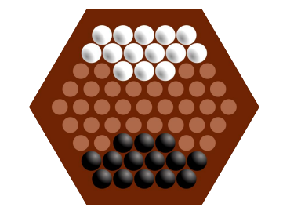 
 

<h2><u>Game Rules:</u></h2>
<ol>
    <li>A player can push their opponent's marbles that are in a line to their own with an in-line move only.</li>
    <li>They can only push if the pushing line has more marbles than the pushed line (three can push one or two; two can push one).</li>
    <li>Marbles must be pushed to an empty space (i.e. not blocked by a marble) or off the board.</li>
    <li>The winner is the first player to push six of the opponent's marbles off of the edge of the board.</li>
</ol>
 

<h2><u>Game Structure:</u></h2>

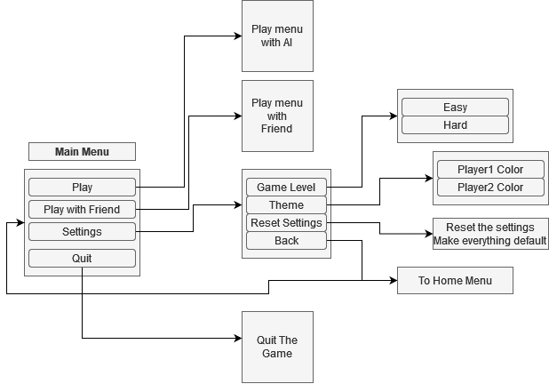 

<h2><u>Game UI:</u></h2>

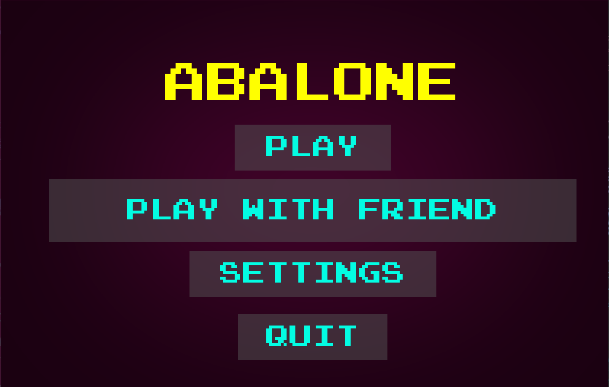 

 

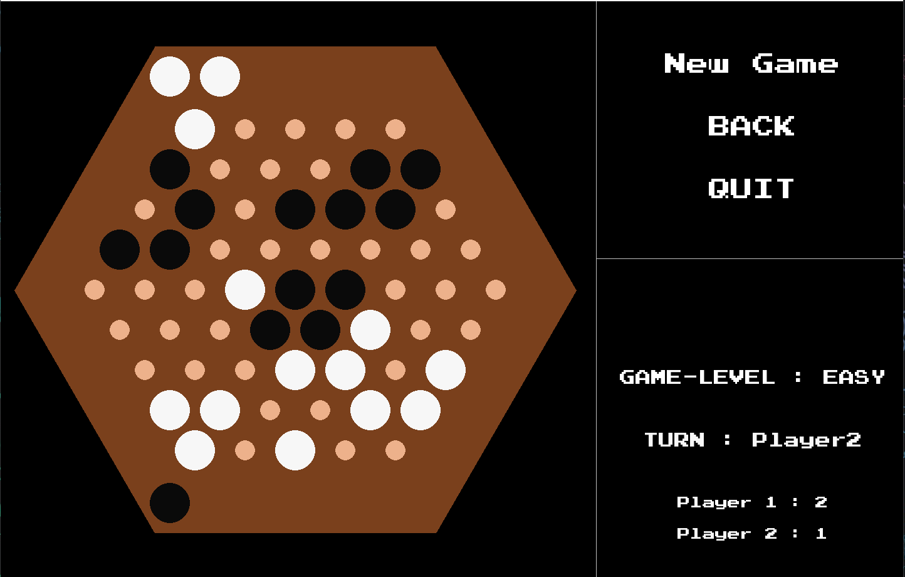 

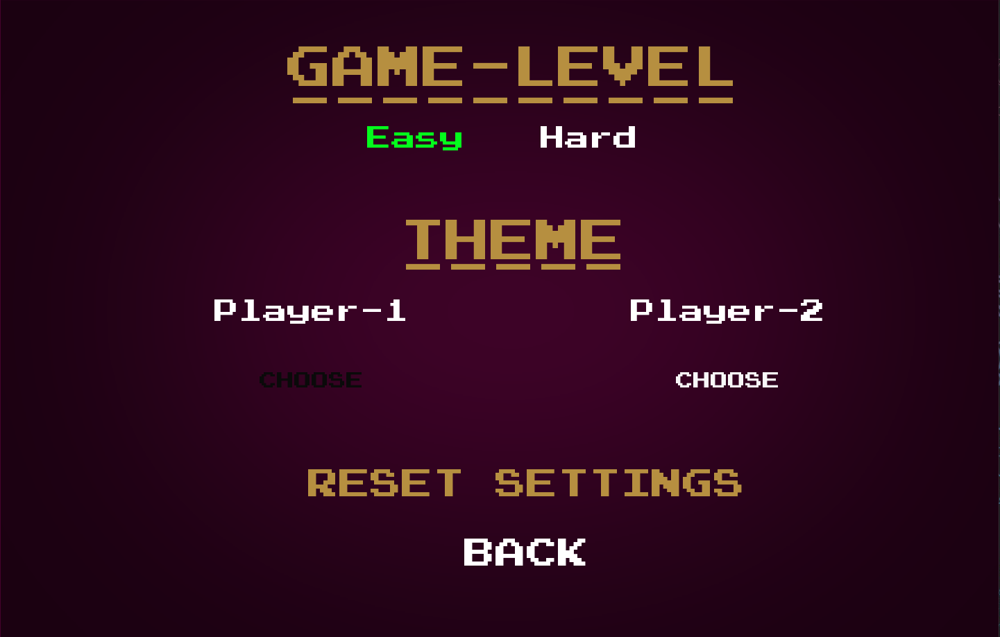 

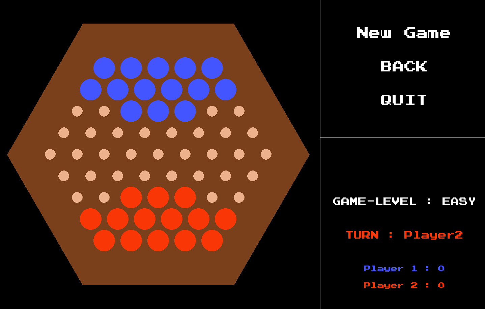 

 

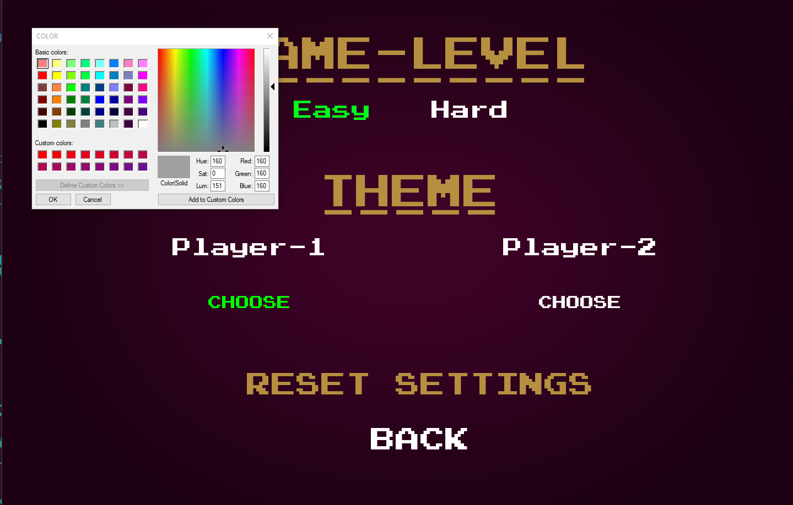 

<h2><u>Move Notations:</u></h2>
The moves can be have given below:
<ol>
    <li>Move one marble at a time to correct direction.</li>
    

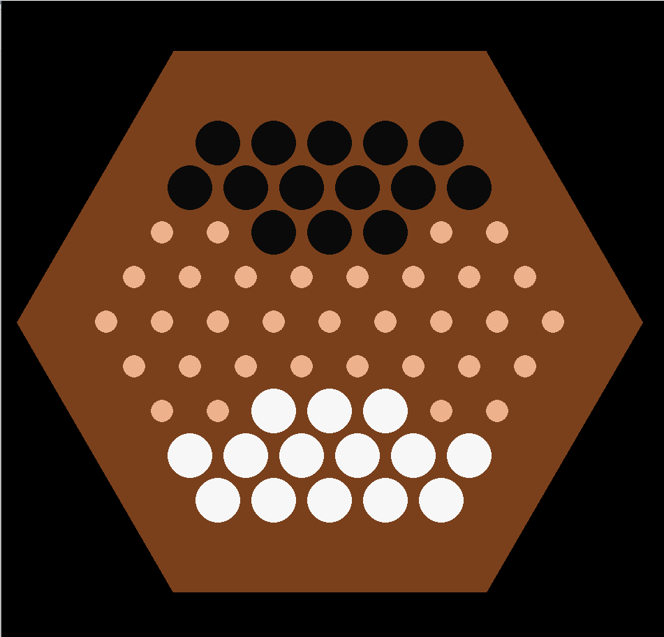 
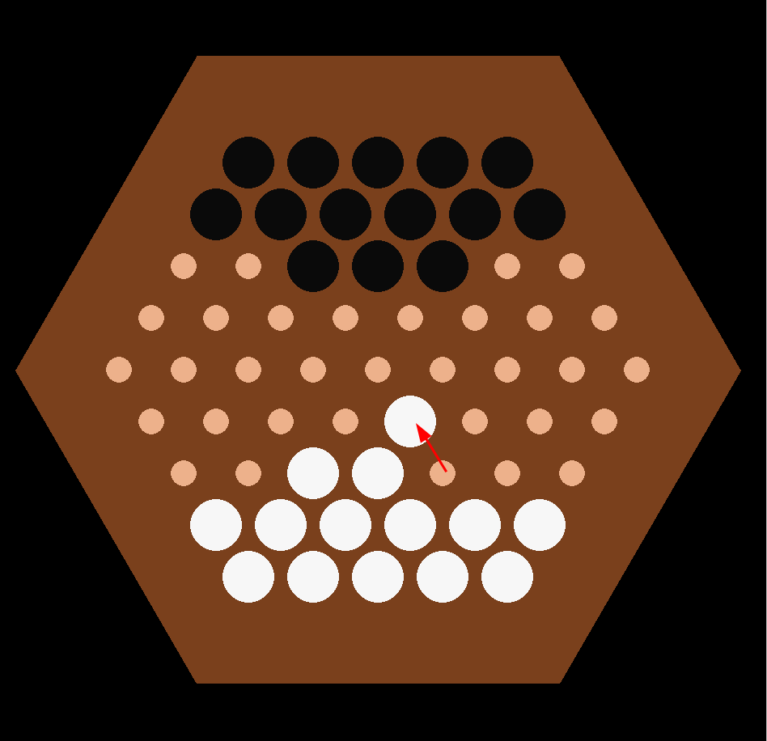 
<li>Move one marble at a time to correct direction.</li>

 
 

<li>Move one marble at a time to correct direction.</li>
 
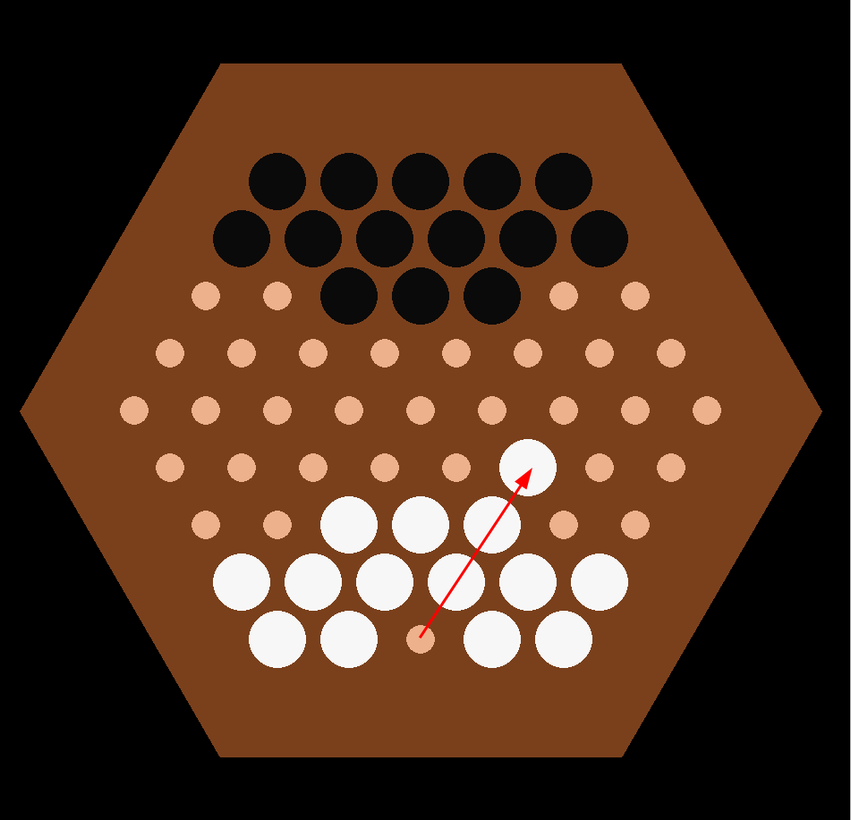 
<li>Unable to do moves.</li>

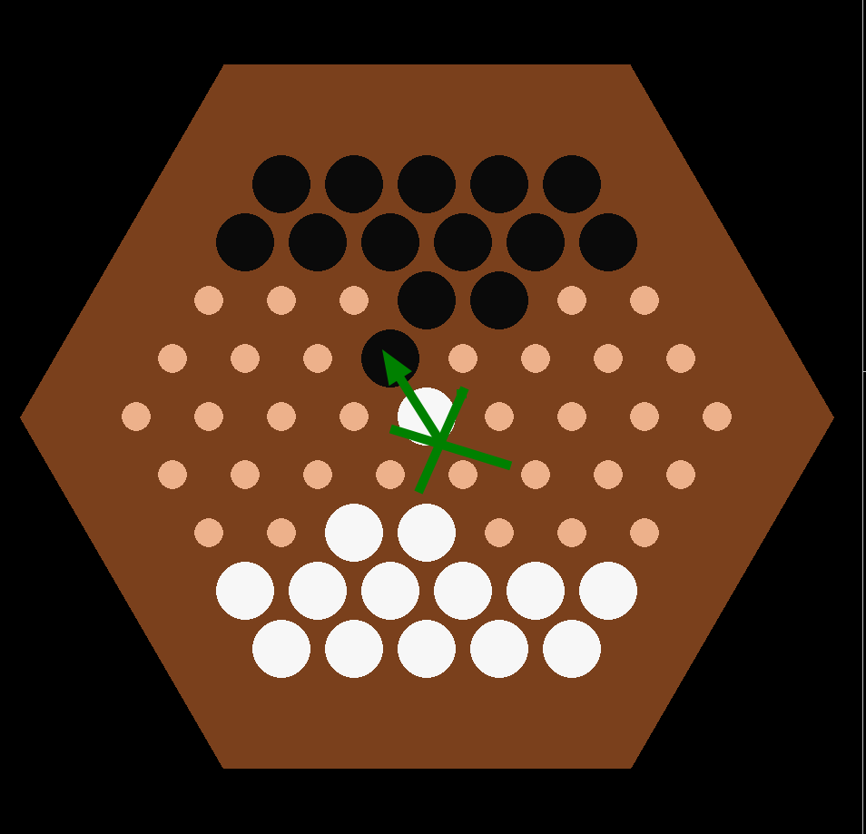 
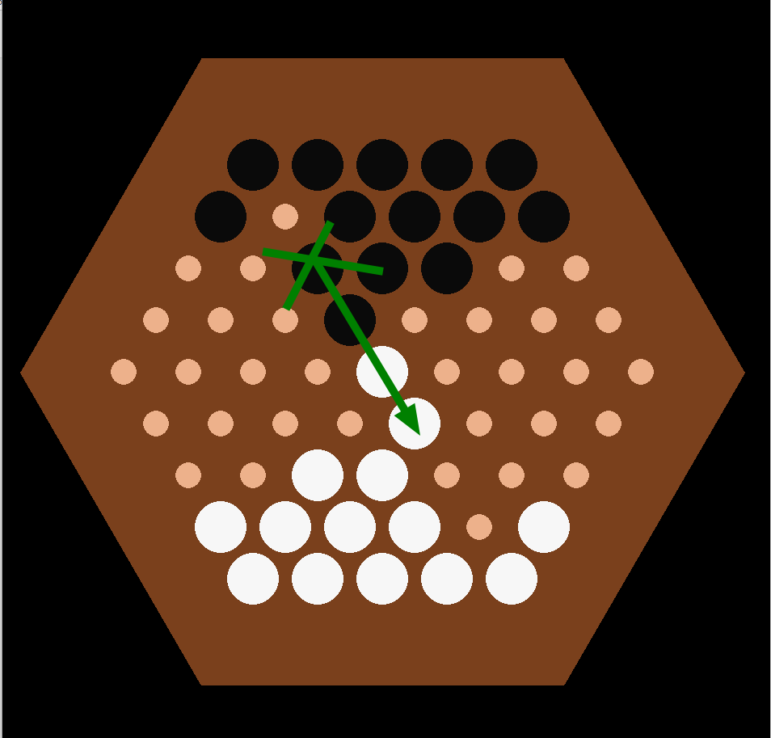 
 

</ol>